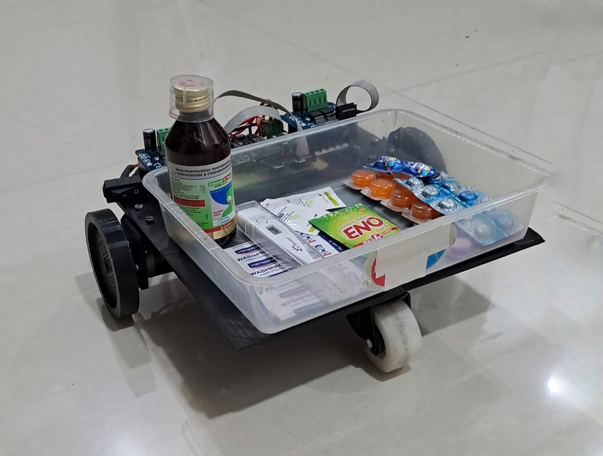
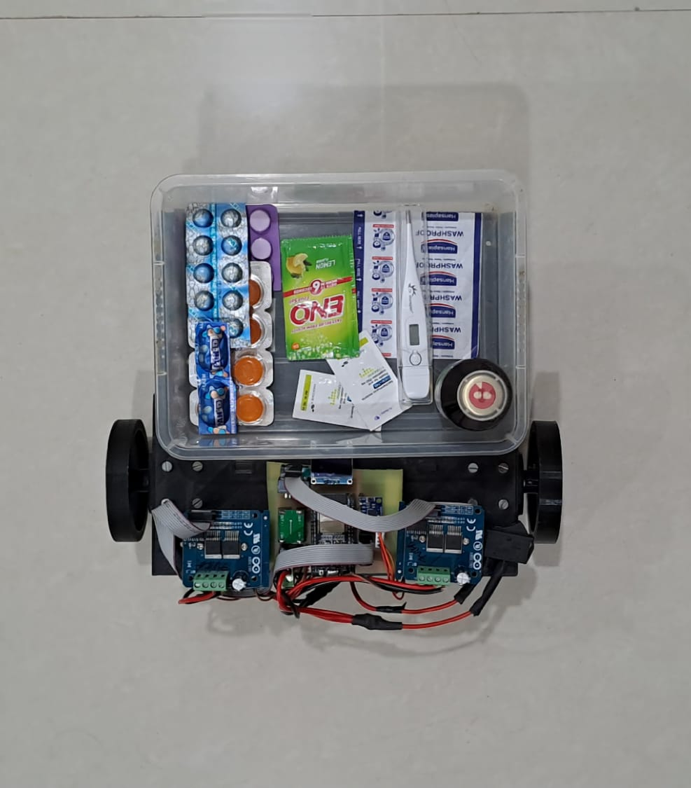
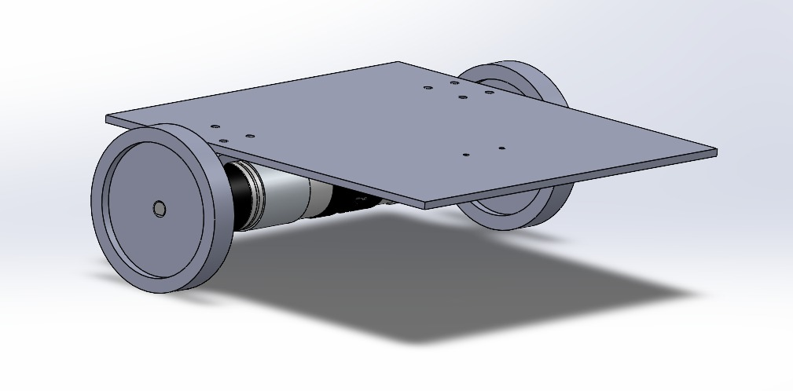
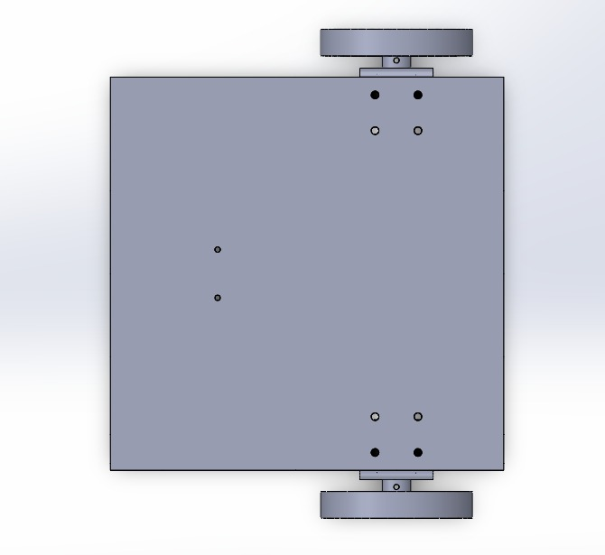
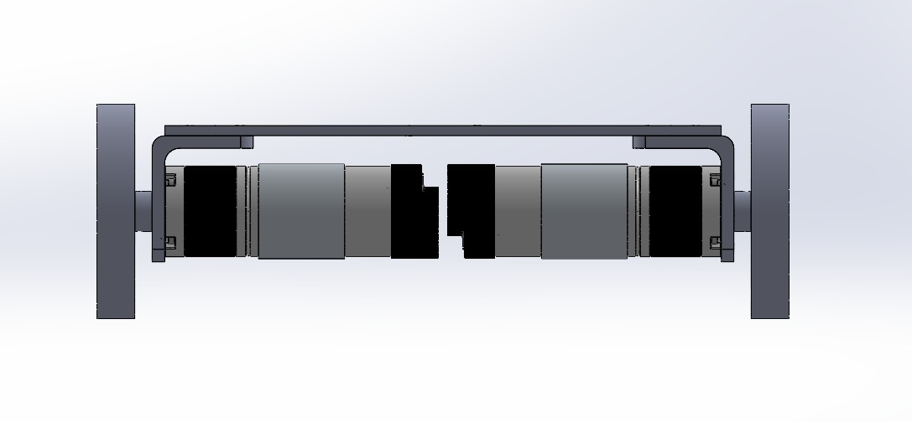
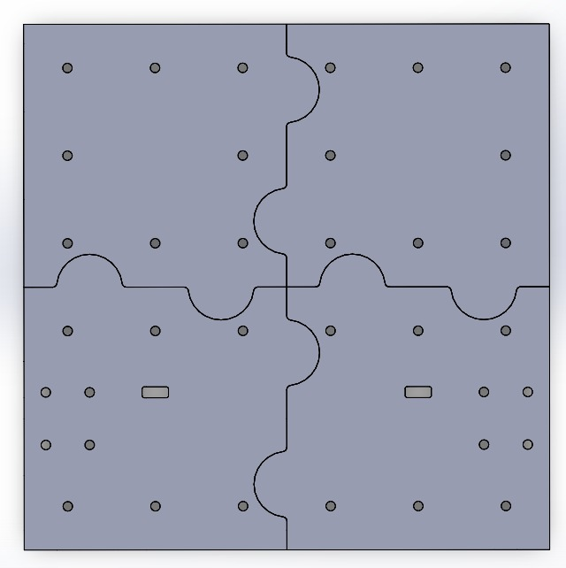
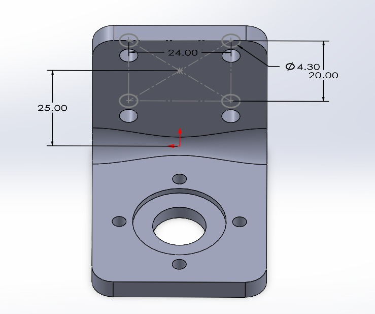
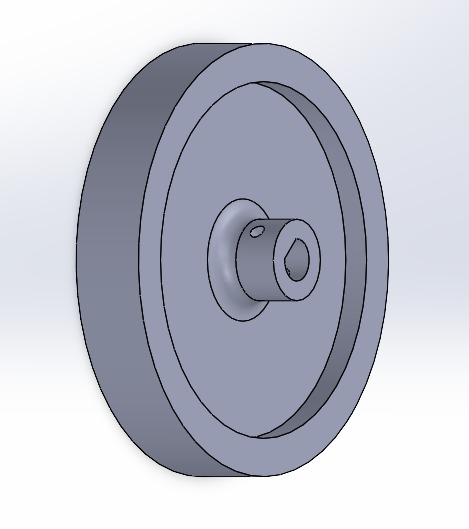
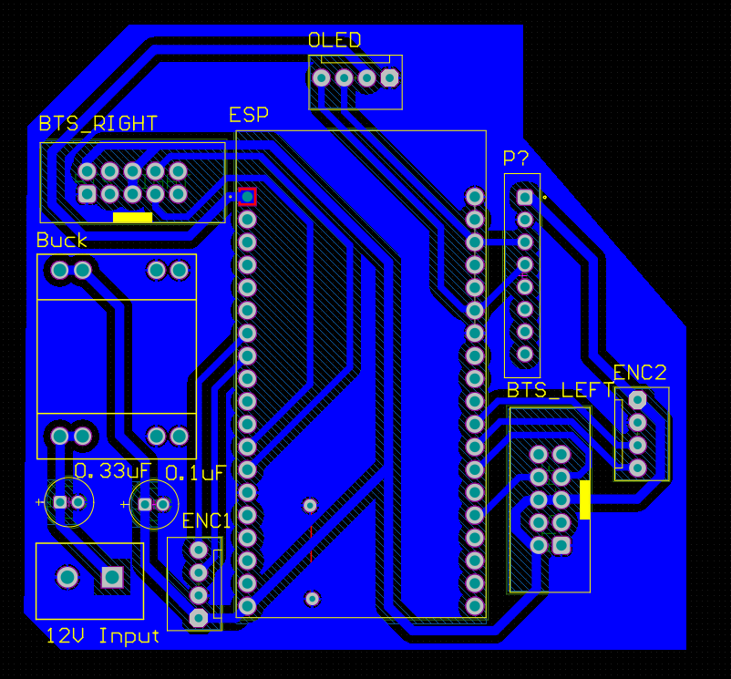
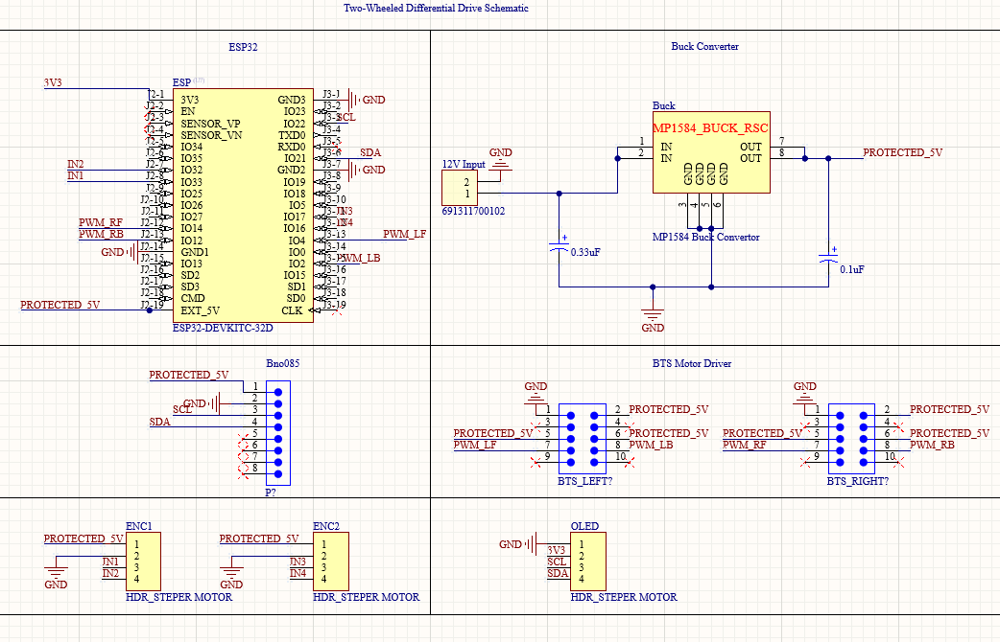

# MediNav

Developed waypoint navigation for automated medicine collection using ESP32, inline encoders, and an MPU-6050 IMU.

Built a real-time telemetry web server using HTML, CSS, and JavaScript with periodic client-side updates for live robot monitoring and debugging.

Designed the PCB for electronic integration, and designed and 3D printed the chassis in SolidWorks.

## Media

### Final Robot

### CAD Design

### PCB

